# FLOW หน้าฟร้อนท์ → DB (leave-approval)

> กล้องซูมจากนอกสุด → ในสุด — ทุก → เช็คจากโค้ดจริง `ไฟล์:บรรทัด`

## ภาพรวมลูกศรใหญ่ (ท่อง 1 ประโยค)

```
[Browser] → main.ts:1 → AppModule:26 (JwtInterceptor:50 + ErrorInterceptor:51) → AppComponent:2 router-outlet
  → AppRouting:11 + AuthGuard:9 / RoleGuard:9 → Pages (Login / Dashboard / LeaveForm / LeaveDetail)
  → LeaveService:9 / AuthService:8 → HttpClient + JwtInterceptor:10 → Express app.js:40
  → middleware (cors:44 → json:51 → rateLimit:55 → db select:71 → auditLog:74 → uploads static:82 → auth)
  → Routes (/api/auth, /api/leave, /api/approval, /api/leave/files, /api/approval/pretemp)
  → Services (leave.service.js:7 / document.service.js:5 / file.service.js:18 / stepper.service.js:1)
  → Store (InMemory store.js:19 vs Supabase supabase-store.js:14 เลือกที่ app.js:71)
  → DB (Postgres Supabase / Memory Array + Supabase Storage leave-documents)
```

### Mermaid (copy ใช้ได้เลย)

```mermaid
graph LR
  Browser --> mainTS[main.ts:1 bootstrap]
  mainTS --> AppModule[AppModule:26]
  AppModule --> Interceptors[JwtInterceptor:50 + ErrorInterceptor:51]
  AppModule --> AppComponent[AppComponent router-outlet 2]
  AppComponent --> Routing[AppRouting:11]
  Routing --> Guards[AuthGuard:9 / RoleGuard:9]
  Guards --> Pages[Login / Dashboard / LeaveForm / LeaveDetail]
  Pages --> Services[LeaveService:9 + AuthService:8]
  Services --> Http[HttpClient + JwtInterceptor:10]
  Http --> Backend[Express app.js:40]
  Backend --> MW[middleware 44>51>55>71>74>82>145]
  MW --> Routes[Routes 117-122]
  Routes --> Svc[leave/document/file/stepper services]
  Svc --> Store{store.js:19 vs supabase-store.js:14}
  Store --> DB[(Postgres / Memory)]
  Store --> Storage[(Storage leave-documents)]
```


---

## 1) Frontend นอกสุด — Entry → Shell → Guard → Service → Component

### 1.1 Entry
- `main.ts:1` `platformBrowserDynamic().bootstrapModule(AppModule)` → จุดสตาร์ท Angular
- `app.module.ts:26` `@NgModule` declarations 8 components + imports `BrowserModule, HttpClientModule, FormsModule, AppRoutingModule, DxDataGridModule`
- `app.module.ts:50-51` `HTTP_INTERCEPTORS` → `JwtInterceptor` ก่อน `ErrorInterceptor` (ลำดับสำคัญ — แนบ token ก่อนจับ error)

### 1.2 Shell
- `app.component.ts:12` `AppComponent.InjectorInstance = injector` → เก็บ static injector ให้ non-component (Dialog) เรียกใช้
- `app.component.html:1-2` `<app-toast>` + `<router-outlet>` → shell เปล่าๆ ทุกหน้า render ผ่าน outlet
- `environments/environment.ts:13` `apiUrl: '/api'` → dev ยิงผ่าน proxy, prod แทนที่ด้วย `environment.prod.ts`

### 1.3 Routing + Guards
- `app-routing.module.ts:11-19`
  - `/login` → LoginComponent (ไม่มี guard)
  - `/dashboard` → `canActivate:[AuthGuard]`
  - `/leave/new` + `/leave/:id/edit` → `canActivate:[AuthGuard, RoleGuard]` `data:{roles:['emp']}` → เฉพาะ emp
  - `/leave/:id` + `/my-leaves/history` → `canActivate:[AuthGuard]`
  - `''` + `**` → redirect `/login`
- `guards/auth.guard.ts:9` `canActivate()` → `auth.isLoggedIn()` ถ้า false `router.navigate(['/login'])`
- `guards/role.guard.ts:9` `canActivate(route)` → เช็ค `route.data['roles']` vs `auth.getUser().role` → ถ้าไม่ตรง `navigate(['/dashboard'])`
- `services/auth.service.ts:50` `isLoggedIn()` → decode JWT `atob` + `exp*1000 > Date.now()` + รองรับไทย `decodeURIComponent`

### 1.4 Interceptors
- `interceptors/jwt.interceptor.ts:10` `intercept()` → `skip = ['/auth/login','/auth/register']` ถ้าไม่ skip + มี token → `clone({setHeaders:{Authorization: Bearer}})` `jwt.interceptor.ts:11-15`
- `interceptors/error.interceptor.ts:19` `intercept()` → `catchError`
  - `silentUrls = ['/stepper','/history','/my-balance','/my-history']` `error.interceptor.ts:26` → ไม่ toast (ให้ component fallback เอง)
  - `401` → `handling401` กันยิงซ้ำ `auth.logout()` + `router.navigate(['/login'])` `error.interceptor.ts:30-37`
  - `403/404/500/default` → `toast.warning/error/info` + `logError()` `error.interceptor.ts:40-64`

### 1.5 Services (Frontend)
- `services/auth.service.ts:15` `login()` → `POST /auth/login` + `tap` save `token/user` ลง `localStorage:18-19`
- `services/leave.service.ts:14` `getLeaves()` → `GET /leave`
- `services/leave.service.ts:18` `getLeave(id)` → `GET /leave/:id`
- `services/leave.service.ts:22` `createLeave()` → `POST /leave` (JSON)
- `services/leave.service.ts:26` `resubmitLeave()` → `POST /leave/:id/resubmit` (JSON หรือ FormData ถ้ามี files `28-34`)
- `services/leave.service.ts:43` `getStepper()` → `GET /leave/:id/stepper`
- `services/leave.service.ts:47` `getHistory()` → `GET /leave/:id/history`
- `services/leave.service.ts:51-60` `approve/sendBack/reject` → `POST /approval/:id/*`
- `services/leave.service.ts:75` `uploadFile()` → `POST /leave/:id/files` (FormData)
- `services/leave.service.ts:93` `uploadVerificationFile()` → `POST /approval/:id/files`
- `services/leave.service.ts:101-106` `pretempPass/pretempSendBack` → `POST /approval/:id/pretemp/*`

### 1.6 Components
- `pages/login/login.component.ts:18` `login()` trim → validate → `auth.login().subscribe` → `router.navigate(['/dashboard'])`
- `pages/dashboard/dashboard.component.ts:29` `ngOnInit` → `auth.getUser()` + `leaveService.getLeaves().pipe(takeUntil)` `dashboard.component.ts:35` → map role title `emp/mgr/hr`
- `pages/leave-form/leave-form.component.ts:66` `ngOnInit` ถ้ามี `route.snapshot.paramMap.get('id')` → `isResubmit=true` + `getLeave()` preload
- `pages/leave-detail/leave-detail.component.ts:43` `ngOnInit` subscribe `paramMap` → `loadData(id)` เพื่อ reload เมื่อกด notification จากหน้าเดิม
- `shared/upload-zone/upload-zone.component.ts:15` `UploadZoneComponent` → `pendingFiles[]`, `existingFileList[]`, `maxFiles=5:19`, `maxSizeMB=10:20`, drag&drop `76-95`, `uploadAll():288` → `firstValueFrom(uploadFn)`
- `shared/stepper/stepper.component.ts:1` + `shared/timeline/timeline.component.ts:1` + `shared/status-badge/status-badge.component.ts:1` → แสดงสถานะจาก `stepper.service`

---

## 2) กดเปิดเว็บ → Login → Dashboard (call chain มีบรรทัด)

```
Browser GET / → main.ts:1 bootstrap → AppModule:53 bootstrap[AppComponent]
  → AppComponent.html:2 router-outlet → AppRouting:18 '' redirect /login
  → LoginComponent.html → ผู้ใช้กรอก username/password → login.component.ts:18 login()
    → auth.service.ts:15 POST /api/auth/login
      → app.js:117 /api/auth → auth.route.js → auth.service.js → db.findUserByUsername (store.js:52 / supabase-store.js:55)
      → bcrypt.compare → jwt.sign → res {token, user}
    → auth.service.ts:17 tap save localStorage → router.navigate(['/dashboard']) login.component.ts:29
  → AuthGuard:9 isLoggedIn() true → DashboardComponent.ts:29 ngOnInit
    → leave.service.ts:14 GET /api/leave (JwtInterceptor:15 แนบ Bearer)
      → app.js:118 leave.route:59 GET / → leave.service.js:47 getLeaves() → db.listLeaves() (store.js:110 / supabase-store.js:205)
      → filter ตาม role (hr ทั้งหมด / mgr ตาม department / emp ของตัวเอง) → map owner_name → res JSON
    → dashboard.component.html DxDataGrid render leaves
```

- Login → `auth.service.ts:28` `logout()` ลบ token/user, `auth.service.ts:33` `getToken()`, `auth.service.ts:37` `getUser()` try/JSON.parse + ล้างถ้า corrupt
- Dashboard → `dashboard.component.ts:56` `isOwner()` เปรียบเทียบ `String(user_id) === String(user.id)` กัน type drift (UUID vs number)

---

## 3) กดยื่นลา — Create 2 ขั้น + Resubmit atomic (ละเอียดสุด)

### 3.1 Create 2 ขั้น (POST ได้ id → POST files + auto SU→DC)

```
LeaveFormComponent.ts:112 submit() → validate (leaveType/start/end/reason:116-143)
  → data: CreateLeaveRequest {leave_type,start_date,end_date,reason} :145
  → handleCreate() leave-form.ts:169
    → ขั้น 1: leave.service.ts:22 POST /api/leave (JSON)
      → app.js:118 leave.route:64 POST / (roleMiddleware emp) → leave.service.js:16 create()
        → validate leave_type quota:19, date:20, reason:22
        → db.createLeave() (store.js:84 / supabase-store.js:129) default SU, flag N, gen request_no (_nextRequestNo)
        → db.addHistory() SU:35 remark ยื่นคำขอลา → res 201 {id, request_no, SU}
    → ขั้น 2: leave-form.ts:174 tempLeaveId = res.id → showUploadSection=true
            leave-form.ts:177 sync uploadZone.leaveId = tempLeaveId (กัน race Input ยังเป็น '')
            hasPending? → uploadZone.uploadAll() upload-zone.ts:288
              → POST /api/leave/:id/files file.route.js:39 (upload.array files 5:40)
                → file.route:48 getLeaveById → check 404
                → file.route:52-58 canAccessLeave (emp เจ้าของเท่านั้น)
                → file.route:61 block ถ้า AP/RJ/CX
                → file.route:66 block emp ที่ MA
                → file.route:80-104 เช็ค quota 5 ไฟล์ + ชื่อซ้ำ (รวม existingFiles)
                → file.route:109-123 เช็ค stage (emp: SU/DC หรือ flag Y, hr/mgr: ต้อง DC)
                → file.route:126 loop fileService.saveFile() file.service.js:32 (Vercel buffer→Supabase Storage / local disk)
                  → db.createDocument() (store.js:156 / supabase-store.js:275) is_deleted N
                → file.route:152 auto SU→DC ★ สำคัญ ★
                  if (SU && emp) {
                    updatePayload = {current_status:'DC', flag_send_back:N?} :154
                    where = {current_status:'SU', flag_send_back:เดิม} :156
                    db.updateLeaveWhere(id, payload, where) (store.js:129 / supabase-store.js:240) → ถ้า null = โดนชิง → throw
                    db.addHistory() DC:161 remark อัปโหลดเอกสารแล้ว / อัปโหลดใหม่หลังส่งกลับ
                  }
                → res 201 {files} หรือ 201 {files, warning, autoTransitionOk:false} ถ้า transition พัง :178

→ leave-form.ts:184 toast ส่งคำขอลาเรียบร้อย + setTimeout navigate /dashboard 1500ms
```

- **ทำไม 2 ขั้น?** `leave-form.component.ts:44` `uploadFilesFn` ต้องมี `tempLeaveId` ก่อน — สร้างใบลาก่อนถึงรู้ `leaveId` สำหรับ path `uploads/:id` หรือ `storage/:id`
- **Idempotence:** ถ้าไม่มี `pendingFiles` `leave-form.ts:193` ก็จบที่ขั้น 1 เลย (ส่งคำขอเปล่าได้ แต่ validate บังคับต้องมีไฟล์ `139`)
- **Cleanup ถ้า saveFile พังครึ่งๆ:** `file.route.js:133` ลบไฟล์ที่ save ไปแล้ว + ลบ temp disk files

### 3.2 Resubmit atomic (ส่งพร้อมไฟล์ทีเดียว กัน flag ล้างก่อนอัปโหลด)

```
LeaveFormComponent.ts:213 handleResubmit() → files = [...uploadZone.pendingFiles] :222
  → leave.service.ts:26 resubmitLeave(id, data, files) → FormData append 4 fields + files :28-33
    → POST /api/leave/:id/resubmit (multipart) leave.route:84
      → upload.array files 5 :85
      → fileService.getFiles + เช็ค quota 5 + ชื่อซ้ำ :105-126
      → loop fileService.saveFile() ก่อน resubmit :132-147 (ถ้า save พัง → cleanup + 502)
      → ★ leave.service.js:176 resubmit() → leave.service.js:176
        → check owner, flag Y, status SU → validate fields 185-194
        → updateFields = {DC, flag N + leave_type/start/end/reason ถ้ามี} :196
        → db.updateLeaveWhere(id, {DC,N}, {flag:Y, status:SU}) :205 ← optimistic lock
           fallback F legacy :208 (DB เก่า current_status='F')
           ถ้า null → fresh check → 409 {error:ถูกส่งไปแล้ว} :214
        → db.addHistory() DC remark ส่งคำขออีกครั้ง :223
      → ถ้า resubmit fail แต่เพิ่ง save files → rollback ลบไฟล์ที่เพิ่ง save :152-163
      → res JSON leave (DC)
  → leave-form.ts:229 เคลียร์ pendingFiles + loadExistingFiles() + toast + navigate /dashboard
  → ถ้า 409 → leave-form.ts:241 toast คำขอนี้ถูกส่งไปแล้ว + navigate 1200ms
```

- **Atomic:** `leave-form.ts:210` comment "ส่งข้อมูล+ไฟล์พร้อมกัน request เดียว กัน flag ล้างก่อนอัปโหลด" — เดิมแยก 2 request แล้วไฟล์พังจะค้าง DC,N ส่งซ้ำไม่ได้
- **WHERE 409:** `leave.service.js:205` `updateLeaveWhere` WHERE `flag_send_back=Y + SU` → ถ้า tab อื่นชิงไปแล้ว → null → 409

---

## 4) กดดู Detail + Stepper/History + Upload + Approval

### 4.1 Detail Load
```
leave-detail.ts:43 ngOnInit subscribe paramMap → loadData(id):68
  → leave-detail.ts:75 getLeave(id) → switchMap → forkJoin
    → leave.service.ts:43 getStepper(id) + leave.service.ts:47 getHistory(id) (catchError → of([]))
  → app.js:118 leave.route:185 GET /:id/stepper (validateId + canAccessLeave:16)
    → leave.service.js:268 getStepper() → db.getLeaveById + db.listHistoryByLeave → stepper.service.js:59 getStepperSteps()
  → leave.route:199 GET /:id/history → leave.service.js:277 getHistory() → stepper.service.js:111 buildHistoryTimeline()
  → forkJoin map → stepperSteps + timelineItems → render
  → ถ้า leave ไม่มี id → throw leave not found → toast โหลดล้มเหลว
```

- `leave-detail.ts:124-177` getters: `canApprove` (mgr+MA), `canDoPretemp` (hr/mgr+DC), `canSendBack/canReject` (DC:hr/mgr, MA:mgr), `canCancel` (emp+owner+SU), `canResubmit` (emp+flag Y)
- `leave-detail.ts:188` `authFileAccess` แยกสำหรับ files/stepper/history — ถ้าไม่มีสิทธิ์ → 403 แยก 404 (กัน enumerate) `leave.route:74-77`

### 4.2 Upload บน Detail
- `leave-detail.ts:396` `onEmpUpload(files)` → `leaveService.uploadFile(id, files)` → `file.route.js:39` (emp stage)
- `leave-detail.ts:416` `onVerificationUpload(files)` → `leaveService.uploadVerificationFile(id, files)` → `verification-file.route.js:34` POST `/:id/files` (role hr/mgr, status DC เท่านั้น `verification-file.route.js:48`)
- `leave-detail.ts:113` `onEmpUploadComplete()` → `reloadLeave()` รีเฟรช status หลัง SU→DC (eventual consistency)
- `upload-zone.component.ts:76` drag&drop + `fileFilter` + `addFiles()` เช็ค extension `115-119`, size `123`, ชื่อซ้ำ `128-133`
- `upload-zone.component.ts:166` `downloadFile()` → `leave.service.ts:89 GET /:id/files/:fileId blob` → `window.URL.createObjectURL` download
- `upload-zone.component.ts:211` `openPreview()` → download blob → `DomSanitizer.bypassSecurityTrustResourceUrl`

### 4.3 Approval — 2 เส้นแยก (คนละ route, คนละ service)

```
เส้น 1: Manager Approve/Reject/SendBack (MA)
  Detail กด อนุมัติ → handleApprove() leave-detail.ts:320 → showConfirmDialog → leave.service.ts:51 POST /approval/:id/approve {remark}
    → app.js:119 approval.route:28 POST /:id/approve (auth + role mgr:11 + validateId)
      → leave.service.js:78 approve() → check role mgr, status MA → transition(MA→AP) leave.service.js:84
        → leave.service.js:235 transition() WHERE MA → db.updateLeaveWhere(id,{AP},{MA}) → ถ้า null → 409
        → db.addHistory(AP) :256

  ส่งกลับที่ MA → handleSendBack() :341 → leave.service.ts:55 POST /approval/:id/sendback
    → approval.route:37 → leave.service.js:90 sendBack() → check DC/MA, MA ต้อง mgr, remark required → updateLeaveWhere WHERE prevStatus → DC:SU+Y :116-128 + history SB

  ไม่อนุมัติ → handleReject() :361 → leave.service.ts:59 POST /approval/:id/reject
    → approval.route:46 → leave.service.js:142 reject() → check DC/MA, MA ต้อง mgr → transition(target RJ, WHERE prevStatus) :159 → 409 ถ้าชิง

เส้น 2: Document Verification (DC → MA) — HR/MGR
  Detail กด ผ่านครบถ้วน → handlePretempPass() :227 → confirm 2 ชั้น + check files ว่าง → leave.service.ts:101 POST /approval/:id/pretemp/pass
    → app.js:121 document.route:19 POST /:id/pretemp/pass (auth+role mgr/hr:17)
      → document.service.js:15 pretempPass() → check DC, role hr/mgr → db.updateLeaveWhere(DC→MA) :25 WHERE DC → 409 :29 + _addVerification pretemp/pass:36 + _addHistory MA:37

  ส่งกลับแก้เอกสาร → handlePretempSendBack() :255 → leave.service.ts:105 POST /approval/:id/pretemp/sendback
    → document.route:25 → document.service.js:41 pretempSendBack() → check DC → payload SU+Y :50 → updateLeaveWhere WHERE DC :57 → 409 → verification sendback + history SB

  ไม่อนุมัติที่ DC → handlePretempReject() :275 → leave.service.ts:59 reject() ที่ DC (hr/mgr ทำได้)
```

- `document.route:32-46` `temp/pass` deprecated → 410 `Workflow migrated: VC removed`
- `leave-detail.ts:213` `guardHrBlockedAtM()` → HR กด approve ที่ MA → Dialog "ต้องให้หัวหน้าอนุมัติก่อน"
- `STATUS` กลาง `constants/status.js:26` `SU/DC/MA/AP/SB/CX/RJ` + `FLOW:36` `SU→DC/CX, DC→MA/SU/RJ, MA→AP/SB/RJ` — VC ถูกรวมกับ DC

---

## 5) Backend Pipeline — app.js ลำดับมิดเดิลแวร์ → Routes → Services → WHERE 409 → IDOR → Audit → Error

### 5.1 Middleware Order (app.js:40-145)
```
app.js:44 cors({origin: FRONTEND_URL split, credentials:true})
  → app.js:51 express.json({limit:'1mb'})
  → app.js:55 rateLimit auth 10 req/min/ip (window 60s) → 429 Too many
  → app.js:71 db = supabaseClient ? new SupabaseStore(supabaseClient) : new InMemoryStore()
  → app.js:74 auditLogMiddleware(db) :74 — ทุก /api/ push {method,path,statusCode,durationMs,userId,ip,timestamp} ลง store.auditLogs (MAX 1000: audit-log.middleware.js:1)
  → app.js:82 /uploads static (if !VERCEL) → authMiddleware + canAccessLeave check (owner/hr/mgr same department) → express.static(UPLOAD_PATH) — VERCEL: 107 block → 404 use /api/leave/:id/files/:fileId
  → app.js:117-122 Routes แยก
  → app.js:129 GET /api/health → db.getCounts()
  → app.js:140 GET /api/audit-logs (auth+hr)
  → app.js:145 errorHandler (ต้องท้ายสุด)
  → app.js:149 SPA static (if !VERCEL) → angular-ui/dist else GET / → {status:ok}
```

### 5.2 Routes Map
| เมาท์ | ไฟล์ | เมธอด |
|------|------|-------|
| `/api/auth` | `auth.route.js` | `POST /login, /register` |
| `/api/leave` | `leave.route.js` | `GET /my-history:41, /my-balance:50, GET /:59, POST /:64, GET /:id:69, POST /:id/resubmit:84, POST /:id/cancel:174, GET /:id/stepper:185, GET /:id/history:199` |
| `/api/leave` | `file.route.js` | `POST /:id/files:39, GET /:id/files:202, GET /:id/files/:fileId:213, DELETE /:id/files/:fileId:265` |
| `/api/approval` | `approval.route.js` | `POST /:id/approve:28 (mgr), /sendback:37, /reject:46, /cancel:55` |
| `/api/approval` | `document.route.js` | `POST /:id/pretemp/pass:19, /pretemp/sendback:25, GET /:id/verifications:49` |
| `/api/approval` | `verification-file.route.js` | `POST /:id/files:34, GET /:id/files/:fileId:108` (DC only) |
| `/api/debug` | `debug.route.js` | เปิดเมื่อ `ENABLE_DEBUG=1` หรือ `NODE_ENV!=production` `app.js:124` |

### 5.3 Services + Transition WHERE 409
- `leave.service.js:235` `transition(leaveId,userId,role,target,remark,expectedStatus)` — หัวใจกันชน:
  ```js
  whereStatus = expectedStatus || leave.current_status
  db.updateLeaveWhere(id,{current_status:target},{current_status:whereStatus}) // store.js:129 / supabase-store.js:240
  if (!updated) { fresh = getLeaveById; if (fresh.status !== whereStatus) return {error:'ถูกดำเนินการไปแล้ว', statusCode:409} }
  db.addHistory(target)
  ```
  ใช้ที่ `approve:84 (MA→AP)`, `reject:159 (DC/MA→RJ)`, `cancel:172 (SU→CX)`, `sendBack:117-125 (DC/MA→SU+Y)` — ทุกที่ return 409 ให้ route ส่ง `handleResult:13` `statusCode 409:16`
- `document.service.js:25` `pretempPass DC→MA WHERE DC`, `document.service.js:57` `pretempSendBack DC→SU+Y WHERE DC` — pattern เดียวกัน
- `file.route.js:157` `updateLeaveWhere WHERE SU` auto SU→DC — ถ้า 2 tab อัปโหลดพร้อมกัน แท็บแพ้ได้ warning แต่ไฟล์ยังอยู่
- `store.js:129` `updateLeaveWhere` loop `Object.entries(where)` `String(leave[k]) !== String(v)` → null กัน `F vs SU` drift ด้วย String compare
- `supabase-store.js:240` `updateLeaveWhere` สร้าง query `eq(k,v)` ทีละ where → `select().maybeSingle()` → null คือโดนชิง

### 5.4 canAccessLeave — กัน IDOR (ทุก route ใช้ logic เดียวกัน)
- `leave.route.js:16` `canAccessLeave(db,leaveId,user)` + `file.route.js:15` + `verification-file.route.js:9` → โค้ดเดียวกัน:
  - `owner → allow`
  - `hr → allow ทั้งหมด`
  - `mgr → allow เฉพาะ department เดียวกัน` (`findUserById` ทั้ง mgr+owner เทียบ `department`)
  - นอกนั้น → null → route ตอบ `403` ถ้า exists แต่ไม่มีสิทธิ์, `404` ถ้าไม่ exists (กัน enumerate) `leave.route:74-77`

### 5.5 AuditLog + ErrorHandler
- `middleware/audit-log.middleware.js:5` ทุก `req.path.startsWith('/api/')` → `res.once('finish')` เก็บ `method/path/status/duration/userId/ip/timestamp` ลง `store.auditLogs` ตัดเหลือ 1000
- `middleware/error.middleware.js:1` `errorHandler(err,req,res,next)` → ถ้า `err.statusCode` → `res.status(err.statusCode).json({message})` → `42501 permission denied → 500 grants.sql hint` → `SyntaxError → 400 JSON ไม่ถูกต้อง` → default 500 + `unhandledRejection` log

---

## 6) DB Layer — InMemory vs Supabase + Storage + Normalize + RPC + SignedUrl

### 6.1 เลือก DB ที่ app.js:71
```js
const db = supabaseClient ? new SupabaseStore(supabaseClient) : new InMemoryStore() // app.js:71
app.set('db', db) // แชร์ให้ routes/services
```
- `supabase.js` → สร้าง client จาก `.env` (`SUPABASE_URL` + `SUPABASE_SECRET_KEY`) ถ้า placeholder/null → fallback memory
- Log `app.js:172` `Data layer: Supabase (Postgres) vs In-Memory`

### 6.2 Method Map (ชื่อเดียวกัน สลับได้เลย)
| Method | InMemory | Supabase | ใช้ที่ |
|--------|----------|----------|--------|
| `seed()` | `store.js:36` hash 123456 4 users | `supabase-store.js:23` check exists→skip else insert 4 users | `app.js:166` `await db.seed()` |
| `getCounts()` | `store.js:47` `users.length/leaves.length` | `supabase-store.js:43` `select count exact head:true` throw 42501 ชัด | `GET /api/health` |
| `findUserByUsername` | `store.js:52` `find` | `supabase-store.js:55` `from users eq username maybeSingle` | auth |
| `findUserById` | `store.js:56` | `supabase-store.js:61` | canAccessLeave |
| `listUsers` | `store.js:60` | `supabase-store.js:67` | getLeaves nameMap |
| `createUser` | `store.js:64` | `supabase-store.js:72` | register |
| `_nextRequestNo` | `store.js:70` `LV-YYYY-0001` จาก MAX ใน array | `supabase-store.js:82` `rpc('next_request_no')` atomic → fallback `like prefix order desc limit1` → fallback `count+1` | `createLeave` |
| `createLeave` | `store.js:84` whitelist SU/DC/MA/AP/SB/CX/RJ, F→SU, gen request_no | `supabase-store.js:129` retry 3 ครั้ง + handle 23505 duplicate + 42703 missing column + 23514 SU↔F drift | `leave.service:23` |
| `getLeaveById` | `store.js:105` `_norm F→SU` | `supabase-store.js:199` `_normalizeLeave F→SU` | ทุก GET |
| `listLeaves` | `store.js:110` map _norm + sort updated_at→created_at | `supabase-store.js:205` `order updated_at desc, created_at desc, request_no desc` + map normalize | `getLeaves` |
| `updateLeave` | `store.js:121` `Object.assign + updated_at` | `supabase-store.js:215` `update().eq(id).select().single()` + SU↔F retry | `transition fallback` |
| `updateLeaveWhere` | `store.js:129` loop where String compare → null ถ้าไม่ตรง → updated_at | `supabase-store.js:240` `update(fields).eq(id).eq(k,v)...select().maybeSingle()` → null คือชิงแล้ว | ทุก WHERE 409 |
| `addHistory/listHistory` | `store.js:144/150` array + sort created_at | `supabase-store.js:253/263` `insert/select` `leave_status_history` | history/stepper |
| `createDocument` | `store.js:156` `is_deleted:false` | `supabase-store.js:275` `is_deleted:'N'` → map to boolean | file save |
| `listDocuments` | `store.js:162` `filter !is_deleted` | `supabase-store.js:285` `eq is_deleted N` | getFiles |
| `findDocument` | `store.js:166` check is_deleted | `supabase-store.js:295` `is_deleted Y → null` | getFile/delete |
| `softDeleteDocument` | `store.js:172` `is_deleted=true` | `supabase-store.js:306` `update is_deleted Y` | deleteFile |
| `addVerification` | `store.js:180` | `supabase-store.js:318` `document_verifications` | pretemp |
| `listVerifications` | `store.js:186` | `supabase-store.js:328` | GET verifications |

### 6.3 InMemory รายละเอียด
- `store.js:19` `class InMemoryStore` → arrays `users/leaves/history/documents/verifications/auditLogs:23-28`
- `store.js:31` `_uuid()` → `crypto.randomUUID()`
- `store.js:70` `_nextRequestNo()` → scan leaves หา `LV-YYYY-` max +1 pad 4
- `store.js:84` `createLeave` destructure `current_status/flag/send_back_count/request_no` ออก → whitelist → `F→SU` → `flag Y?Y:N`
- `store.js:103` `_norm(l)` `F→SU` ขาออก ให้ frontend เห็น SU ตลอด

### 6.4 Supabase รายละเอียด
- `supabase-store.js:14` `class SupabaseStore` → `this.supabase`, `this.auditLogs=[]:17`
- `supabase-store.js:82` `_nextRequestNo()` → `rpc('next_request_no')` `nextval` atomic กัน 2 request 09:00:00.001 ชน — fallback `MAX+1` + `count+1` ถ้าไม่มี function (DB ยังไม่ migrate)
- `supabase-store.js:129` `createLeave` retry 3: handle `23505 request_no duplicate → regen`, `23514 current_status check SU↔F → สลับ`, `42703 missing column → ลองไม่มี request_no`
- `supabase-store.js:193` `_normalizeLeave()` `F→SU` ขาออก — Prod ยังเป็น `F` (debug constraint เจอ `current_status='F'`) แต่โค้ดส่ง `SU` → drift handled
- `supabase-store.js:282` `is_deleted` `'Y'/'N'` ใน Postgres ↔ `true/false` ใน code (map ทั้งขาเข้า/ออก)

### 6.5 Storage — Vercel memoryStorage vs Local disk
- `middleware/upload.middleware.js:22` `storage = isVercel ? multer.memoryStorage() : multer.diskStorage(...)`
  - disk: `destination` `path.resolve(UPLOAD_PATH, id)` `mkdirSync recursive:31` guard path traversal `29`, `filename` `uuid+ext:39`
  - memory: ไม่มี `path/filename` → `file.service.js` gen `uuid+ext:51`
- `middleware/upload.middleware.js:5` `UPLOAD_PATH = env UPLOAD_PATH || 'uploads'`
- `middleware/upload.middleware.js:12` `isValidId` → `UUID_RE` หรือ `^\d+$` กัน `/ \ . ..`
- `middleware/upload.middleware.js:43` `fileFilter` allow `pdf/jpeg/png/docx` + fallback `octet-stream/zip` สำหรับ docx เพี้ยน
- `middleware/upload.middleware.js:62` `limits {fileSize:10MB, files:5}`
- `file.service.js:32` `saveFile(leaveId,userId,file,stage)` → ถ้า `isVercel && buffer && supabase` → `supabase.storage.from('leave-documents').upload(supabasePath, buffer) :54` → `db.createDocument({file_path: supabasePath})`
  - fallback local/buffer-less → `path.join(leaveId, filename)` `disk path` `file.service.js:96-119`
  - `file.service.js:148` `deleteFile` → Vercel → `supabase.storage.remove([file_path])` `else → fs.unlinkSync(path.resolve(UPLOAD_PATH,file_path))` + guard traversal `166` + `softDeleteDocument`
  - `file.service.js:7` `decodeFilename` `latin1→utf8` กันชื่อไฟล์ไทยเพี้ยน `à¹..`

### 6.6 Download — SignedUrl (Vercel) vs Disk
- `file.route.js:213` `GET /:id/files/:fileId` → `authFileAccess:188` → `fileService.getFile` → `404` ถ้าไม่เจอ
  - Vercel `isVercel:221` → `supabase.storage.from('leave-documents').createSignedUrl(file.file_path,60) :230` → `res.redirect(signedUrl)` ถ้า error → `404`
  - Local → `path.resolve(UPLOAD_PATH,file.file_path).startsWith(...)` guard `247` → `res.download(fullPath, original_name) :251`
- `verification-file.route.js:108` download เดียวกันสำหรับ `hr/mgr` files
- `app.js:82` `GET /uploads/:id/:file` static ก็ `createSignedUrl` แบบเดียวกัน (Vercel block 107)

### 6.7 ตาราง Status กลาง
- `constants/status.js:26` `STATUS = {SU:ยื่นคำขอ, DC:รอตรวจสอบเอกสาร, MA:รอหัวหน้าอนุมัติ, AP:อนุมัติแล้ว, SB:ส่งกลับแก้ไข, CX:ยกเลิก, RJ:ไม่อนุมัติ}`
- `stepper.service.js:11` `BASE_STEPS 3 ขั้น + getFinalStep polymorphic seq4`
- `stepper.service.js:42` `getMaxReachedIndex` map `SU/F:0 DC/VC:1 MA:2 AP:3` ใช้ history หา maxReached
- `stepper.service.js:59` `getStepperSteps` คำนวณ `done/current/pending/rejected/cancelled` ต่อ `current_status + flag_send_back + history`

---

## ท่อง 1 หน้า (ชีทสรุป)

```
Browser → main:1 → AppModule:50 Jwt/Error → AppComponent:2 outlet → Routing:11 + Guard:9 → Pages
  Login:18 → AuthService:15 POST /auth/login → localStorage token → /dashboard
  Dashboard:29 → LeaveService:14 GET /leave → leave.route:59 → leave.service:47 → db.listLeaves
  ยื่นลา Create 2 ขั้น:
    1) POST /leave → leave.service:16 → db.createLeave SU → history SU
    2) POST /leave/:id/files → file.route:39 → quota5+ชื่อซ้ำ → saveFile → auto SU→DC file.route:152 WHERE SU 409
  ส่งกลับ Resubmit atomic:
    POST /:id/resubmit multipart → leave.route:84 → saveFile ก่อน → leave.service:176 WHERE flag Y+SU 409 → history DC
  Detail: loadData:68 → getLeave + forkJoin stepper:43 history:47 → stepper.service:59/111
  ตรวจเอกสาร pretemp: document.route:19 POST /pretemp/pass → document.service:15 WHERE DC→MA 409 (hr/mgr)
  อนุมัติ: approval.route:28 POST /approve (mgr) → leave.service:78 WHERE MA→AP 409
  ส่งกลับ/ไม่อนุมัติ: WHERE DC/MA→SU/RJ 409 ทั้งระบบ
  IDOR: canAccessLeave leave.route:16 file.route:15 verification:9 (owner/hr/mgr dept)
  Middleware app.js:44 cors 51 json 55 rateLimit 71 dbเลือก 74 auditLog 82 uploads 145 errorHandler
  DB: store.js:19 memory vs supabase-store.js:14 postgres เลือก app.js:71
     _nextRequestNo RPC next_request_no:82 fallback MAX+1, is_deleted Y/N↔bool, F→SU normalize, signedUrl 60s
```

---

## อ้างอิงไฟล์:บรรทัด (ตรวจแล้ว)

| โซน | ไฟล์:บรรทัด | ใช้ทำอะไร |
|-----|-------------|-----------|
| Entry | `main.ts:1` | bootstrap AppModule |
| Module | `app.module.ts:50-51` | Jwt + Error interceptors |
| Shell | `app.component.html:2` | router-outlet |
| Shell | `app.component.ts:12` | InjectorInstance |
| Routing | `app-routing.module.ts:11-19` | routes + RoleGuard roles emp |
| Guard | `guards/auth.guard.ts:9` | isLoggedIn → /login |
| Guard | `guards/role.guard.ts:9` | check roles → /dashboard |
| Interceptor | `interceptors/jwt.interceptor.ts:10` | skip login/register, Bearer |
| Interceptor | `interceptors/error.interceptor.ts:19,26,30` | silentUrls, 401 logout→/login |
| Auth Svc | `services/auth.service.ts:15,50` | login POST, isLoggedIn decode |
| Leave Svc | `services/leave.service.ts:22,26,43,47,51,75,101` | create/resubmit/stepper/history/approve/upload/pretemp |
| LeaveForm | `pages/leave-form/leave-form.component.ts:169,174,213,222` | handleCreate 2 ขั้น, handleResubmit atomic |
| Detail | `pages/leave-detail/leave-detail.component.ts:68,75,113,227,320` | loadData, getStepper/History, uploadComplete, pretempPass, approve |
| UploadZone | `shared/upload-zone/upload-zone.component.ts:288` | uploadAll firstValueFrom |
| Backend | `leave-api/src/app.js:71,74,82,117-122,145` | dbเลือก, auditLog, static, routes, errorHandler |
| Upload MW | `middleware/upload.middleware.js:22,43,62` | memory vs disk, fileFilter, limits 10MB/5 |
| Auth MW | `middleware/auth.middleware.js:3` | Bearer verify |
| Role MW | `middleware/role.middleware.js:1` | allowedRoles includes |
| Audit | `middleware/audit-log.middleware.js:5` | push auditLogs MAX 1000 |
| Error | `middleware/error.middleware.js:1` | statusCode / 42501 / SyntaxError |
| Leave Route | `routes/leave.route.js:16,59,64,69,84,185,199` | canAccessLeave, GET/, POST/, GET/:id, resubmit, stepper, history |
| File Route | `routes/file.route.js:15,39,152,213,265` | canAccess, POST files, auto SU→DC, GET download, DELETE |
| Approval | `routes/approval.route.js:28,37,46` | approve(mgr) / sendback / reject |
| Document | `routes/document.route.js:19,25` | pretemp/pass, sendback (hr/mgr) |
| Verif File | `routes/verification-file.route.js:34,48` | POST files DC only |
| Leave Svc BE | `services/leave.service.js:16,47,78,90,142,176,235` | create, getLeaves, approve, sendBack, reject, resubmit, transition WHERE |
| Doc Svc | `services/document.service.js:15,41` | pretempPass/sendBack WHERE DC |
| Stepper Svc | `services/stepper.service.js:59,111` | getStepperSteps, buildHistoryTimeline |
| Status | `constants/status.js:26,36` | STATUS, FLOW |
| Store | `src/store.js:19,70,84,129` | InMemoryStore, _nextRequestNo, createLeave, updateLeaveWhere |
| SupaStore | `src/db/supabase-store.js:14,82,129,240` | SupabaseStore, _nextRequestNo RPC, createLeave retry, updateLeaveWhere |
| File Svc BE | `services/file.service.js:32,148` | saveFile (Supabase vs disk), deleteFile |
| Supabase | `src/db/supabase.js` | client init (env) |
| Health | `src/app.js:129` | GET /api/health getCounts |

> เขียนจากโค้ดจริง — ไม่มี TODO / stub — ทุกลูกศร → มีไฟล์:บรรทัดรองรับ
